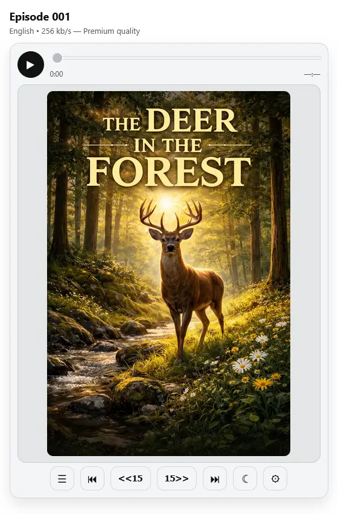

# Compact Audio Player

> Vibe-coded: rapid prototype, zero build step.

A static-site friendly audiobook/podcast player (single HTML page) with multi-language audio, chapter navigation, and a quality selector that automatically picks the best codec family for the current browser.

This repo is **vanilla HTML/CSS/JS** (no build step).

## Features

- **Play/Pause**
- **Skip back/forward** with configurable interval (5/10/15/30/60 seconds)
- **Prev/Next chapter**
- **WebVTT chapters** (loaded lazily when needed)
- **Audio language selector** (each language can have its own audio files and chapters)
- **Quality selector** (bitrate options), with **smart codec-family selection**
- **Lazy audio loading**: no audio file is requested until the user presses **Play**
- **Playback speed** slider (0.5×–2×)
- **Sleep timer** (pause after X minutes)
- **Cover image** (optional) with a built-in lightbox viewer
- **Appearance controls**: System/Light/Dark + text size
- **Media Session API** support (lock-screen controls)
- **Persistence** via `localStorage`: playback position per episode+language, selected language/quality, UI settings
- **Reset player** link (clears saved settings + cached availability)
- **Optional audiobook library** (`media/library.json`) for a built-in episode/book selector

<p align="center">
  
</p>

## What it does *not* do

- No adaptive streaming (HLS/DASH) and no automatic bitrate switching while playing
- No playlists/queue beyond the simple optional library selector
- No transcript rendering (chapters only)

## Quick start


   - `index.html`
   - `player.js`
   - `player.css`
   - `i18n.js`

2. Create your media folder structure:

```
./media/
  episode-001/
    episode.json
    chapters-en.vtt
    audio-256k.webm
    audio-128k.webm
    audio-256k.m4a
    audio-128k.m4a
    audio-128k.mp3
```

3. Serve the folder via any static server (local testing example):

```bash
python3 -m http.server 8080
```

Then open `http://localhost:8080/`.

## Configuration

### `media/<episode-folder>/episode.json`

This file describes one audiobook/podcast “episode” (a book, an episode, etc.).

**Required** keys:

- `id` (string)
- `defaultLanguage` (string, e.g. `"en"`)
- `languages` (object map)

**Common optional** keys:

- `title` (object map: language → title)
- `cover` (string: relative path, absolute URL, or data URI)
- `duration` (number, seconds)
- `cacheVersion` (number): bump to invalidate cached file availability when you add/remove media files
- `debug.showAllQualities` (boolean)
- `ui.onboardingEnabled` (boolean)

Example:

```json
{
  "id": "episode-001",
  "defaultLanguage": "en",
  "debug": {
    "showAllQualities": false
  },
  "title": {
    "en": "Episode 001",
    "da": "Episode 001",
    "nb": "Episode 001",
    "sv": "Avsnitt 001"
  },
  "cover": "./episode-001.webp",
  "languages": {
    "en": {
      "label": "English",
      "basePath": "media/episode-001/en/",
      "chapters": "chapters.vtt",
      "sources": {
        "opus": {
          "64": "audio-64k.webm",
          "96": "audio-96k.webm",
          "128": "audio-128k.webm",
          "256": "audio-256k.webm"
        },
        "aac": {
          "64": "audio-64k.m4a",
          "96": "audio-96k.m4a",
          "128": "audio-128k.m4a",
          "256": "audio-256k.m4a"
        },
        "mp3": {
          "64": "audio-64k.mp3",
          "96": "audio-96k.mp3",
          "128": "audio-128k.mp3"
        }
      }
    },
    "da": {
      "label": "Dansk",
      "basePath": "media/episode-001/da/",
      "chapters": "chapters.vtt",
      "sources": {
        "opus": {
          "96": "audio-96k.webm",
          "128": "audio-128k.webm",
          "256": "audio-256k.webm",
          "64": "audio-64k.webm"
        },
        "aac": {
          "96": "audio-96k.m4a",
          "128": "audio-128k.m4a",
          "64": "audio-64k.m4a",
          "256": "audio-256k.m4a"
        },
        "mp3": {
          "96": "audio-96k.mp3",
          "128": "audio-128k.mp3",
          "64": "audio-64k.mp3"
        }
      }
    },
    "nb": {
      "label": "Norsk (Bokmål)",
      "basePath": "media/episode-001/nb/",
      "chapters": "chapters.vtt",
      "sources": {
        "opus": {
          "96": "audio-96k.webm",
          "128": "audio-128k.webm",
          "256": "audio-256k.webm",
          "64": "audio-64k.webm"
        },
        "aac": {
          "96": "audio-96k.m4a",
          "128": "audio-128k.m4a",
          "64": "audio-64k.m4a",
          "256": "audio-256k.m4a"
        },
        "mp3": {
          "96": "audio-96k.mp3",
          "128": "audio-128k.mp3",
          "64": "audio-64k.mp3"
        }
      }
    },
    "sv": {
      "label": "Svenska",
      "basePath": "media/episode-001/sv/",
      "chapters": "chapters.vtt",
      "sources": {
        "opus": {
          "96": "audio-96k.webm",
          "128": "audio-128k.webm",
          "256": "audio-256k.webm",
          "64": "audio-64k.webm"
        },
        "aac": {
          "96": "audio-96k.m4a",
          "128": "audio-128k.m4a",
          "64": "audio-64k.m4a",
          "256": "audio-256k.m4a"
        },
        "mp3": {
          "96": "audio-96k.mp3",
          "128": "audio-128k.mp3",
          "64": "audio-64k.mp3"
        }
      }
    }
  },
  "ui": {
    "onboardingEnabled": true
  },
  "cacheVersion": 1 
}
```

#### Language object fields

Each `languages.<code>` object supports:

- `label` (string): label shown in the Audio language selector
- `chapters` (string): WebVTT file path (relative to the episode folder unless you use `basePath`)
- `basePath` (string, optional): prefix added to all relative `sources` and `chapters` paths
- `sources` (object): codec → bitrate → path

Supported codec keys:

- `opus` (typically `.webm` or `.ogg`)
- `aac` (typically `.m4a` / MP4 container)
- `mp3`

### Optional: `media/library.json` (audiobook selector)

If you want a built-in episode/book selector, create `media/library.json`.

- If the library has **0 or 1** valid entry, the selector is hidden.
- The player remembers the last selected episode.
- You can also force an episode via `?episode=<id>`.

Example:

```json
{
  "default": "episode-001",
  "audiofiles": [
    {
      "id": "episode-001",
      "folder": "episode-001",
      "title": {
        "en": "Audiobook 1",
        "da": "Lydbog 1",
        "nb": "Lydbok 1",
        "sv": "Ljudbok 1"
      }
    },
    {
      "id": "episode-002",
      "folder": "episode-002",
      "title": {
        "en": "Audiobook 2",
        "da": "Lydbog 2",
        "nb": "Lydbok 2",
        "sv": "Ljudbok 2"
      }
    }
  ]
}
```

### WebVTT chapters

Chapters are standard WebVTT. Each language can point to a different VTT file.

Minimal example:

```vtt
WEBVTT

00:00:00.000 --> 00:05:12.000
Intro

00:05:12.000 --> 00:18:30.000
Chapter 1
```

Chapters are loaded lazily (when you open Chapters or use Prev/Next chapter).

## Quality selection, codecs, and iOS behavior

The player groups qualities by **codec family**. By default it shows **one** codec family (the best match for the current device) and all existing bitrates for that codec.

Codec preference is centralized and depends on platform:

- **Non‑iOS browsers:** prefer `opus` → `aac` → `mp3`.
- **iOS/iPadOS Safari:** preference depends on the detected major iOS version:
  - **iOS 17–25:** prefer `aac` → `mp3` → `opus` (WebM/Opus can be unreliable)
  - **iOS 26+:** prefer `opus` → `aac` → `mp3`

Runtime fallbacks on iOS:

- If an **Opus** source fails to load/play, the player automatically falls back to **AAC**, then **MP3**.
- If an **AAC** source fails to load/play, the player falls back to **MP3**.

Notes:

- iOS Safari sometimes misreports support via `canPlayType()`; the player applies iOS-specific heuristics so AAC/MP3 aren’t incorrectly hidden.
- The Quality selector only lists files the player believes **exist** on the server (see next section).

## File availability detection and caching

To avoid listing 404 media files, the player probes file URLs and only displays options that exist.

- Primary probe: `HEAD` request
- Fallback probe: small ranged `GET` (`Range: bytes=0-0`)
- If `fetch()` probing is unreliable (some auth/proxy setups), it falls back to an **audio pipeline** probe and may disable fetch-probing automatically for the session.

Caching:

- Results are cached in `localStorage` per episode for **7 days**.
- Bump `cacheVersion` in `episode.json` to invalidate the cache when you add/remove files.

Useful query parameters:

- `?clearAvailCache=1` — clears the cached availability for the current episode
- `?resetProbe=1` — re-enables probing if it was auto-disabled in the current session

## Persistence and reset

The player stores:

- Playback position per **episode + audio language**
- Selected language and quality
- UI settings (theme, text size, player language)
- Playback speed and skip interval
- Cached file availability

Use **Reset player** in the Options panel to clear everything and reload.

## Accessibility and controls

- Buttons and menus include ARIA labels.
- Media Session API (when available): lock-screen play/pause/seek; next/previous maps to chapter navigation.

Keyboard (desktop):

- `Space` — Play/Pause
- `ArrowLeft` / `ArrowRight` — seek 5 seconds back/forward (independent of the Skip interval selector)
- `Esc` — closes open menus/modals

## Theming and customization

Most styling lives in `player.css`. You can adjust CSS variables on `:root` to change accent colors and spacing.

The player also supports:

- System / Light / Dark mode
- Text size: Small / Medium / Large

## Troubleshooting

**I only see “—:—” duration and the seek bar is disabled**

- This is expected until the user presses **Play**. The player avoids loading media metadata on page load.

**A language or quality option is missing**

- The player hides options that appear missing on the server.
- Try `?clearAvailCache=1` after uploading new files.
- If your server blocks `HEAD` or `Range` requests, ensure it returns 200/206 correctly, or rely on the built-in audio-pipeline probe.
