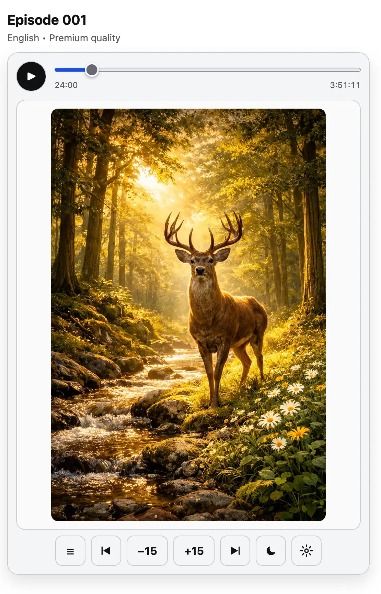

# Compact Audio Player

A dependency-free audiobook and podcast player for static websites. It supports multiple audio languages, WebVTT chapters, selectable quality, codec fallback, saved progress, and accessible custom controls.

Production uses plain HTML, CSS, and JavaScript. There is no build step and no runtime package dependency.

## Features

<p align="center">
  <a href="preview.webp">
    
  </a>
</p>

- Play and pause with lazy audio loading
- Seek bar, current time, duration, and configurable skip buttons
- Previous/next chapter, chapter selection, and current chapter display from WebVTT or embedded M4A/M4B metadata
- Audio-language and quality selection
- Opus, AAC/M4A, and MP3 sources
- Deterministic runtime source fallback
- Playback speed and supported programmatic volume control
- Timed sleep and sleep at the end of a chapter
- External or embedded M4A/M4B cover artwork and a full-size cover dialog
- System, light, and dark themes with three text sizes
- English, Danish, Norwegian Bokmål, and Swedish interface text
- Optional audiobook selector through `media/library.json`
- Optional Media Session lock-screen controls
- Saved progress per episode and audio language
- Safe preference, chapter, and availability caching
- User-initiated offline download for one selected audiobook, language, and quality
- Keyboard controls, focus management, offline feedback, and reduced-motion support

Keyboard shortcuts outside focused controls are Space for play/pause, Left/Right Arrow for a five-second seek, Up Arrow for the configured skip forward, and Down Arrow for the configured skip backward. Escape closes open panels.

The first-visit **How this player works** dialog explains playback, chapters, shortcuts, Options, sleep timer, saved progress, chapter caching, and offline downloads. It also lets the user choose the interface language and audio language before starting. Set `ui.onboardingEnabled` to `false` in `library.json` to disable it for the whole player.

The player does not provide adaptive streaming, a playback queue, or transcript rendering.

## Run locally

ES modules require an HTTP server. Direct `file://` use is not supported.

```bash
python3 -m http.server 8080
```

Open `http://localhost:8080/`.

The example configuration references audio files that are not committed to this repository. Add the configured files under `media/episode-001/<language>/` to test playback.

## Project structure

```text
index.html              Semantic player markup and dialogs
player.css              Responsive layout and design tokens
player.js               Application coordinator and DOM event wiring
sw.js                   Network-first app shell and offline ranged-audio responses
i18n.js                 Interface strings
js/
  availability.js       HEAD and Range availability probes
  chapters.js           Chapter source selection and cached chapter loading
  config.js             Configuration validation and normalization
  dialogs.js            Dialog, panel, and focus behavior
  media-controller.js   Sole owner of audio source, seek, and play transitions
  mp4-chapters.js       Bounded Range-based MP4 chapter and cover parser
  offline.js            Offline preflight, quota checks, chunk downloads, and manifests
  source-selection.js   MIME evidence, quality display, and fallback ordering
  storage.js            Safe preferences, progress, chapter, and availability persistence
  utils.js              Shared utilities and abortable fetch retries
  vtt.js                WebVTT chapter parser
tests/                  Node built-in tests; no test packages required
media/                  Library, episode, cover, and chapter data
```

`player.js` coordinates the modules but does not assign `audio.src`, call `audio.load()`, seek the element, or call `audio.play()` directly. Those operations belong to `media-controller.js` so source changes follow one path.

## Episode configuration

Store each episode at `media/<folder>/episode.json`.

Required fields:

- `id`: stable episode identifier
- `defaultLanguage`: language code used when no saved or browser match exists
- `languages`: map of language code to language configuration

Common optional fields:

- `title`: localized title map
- `cover`: path or HTTP(S) URL; image data URLs are also accepted
- `coverSource`: `file`, `embedded`, `auto`, or `none`; existing configurations with `cover` default to `file`
- `duration`: duration hint in seconds
- `cacheVersion`: change this when audio or chapter files are updated, added, or removed
- `debug.showAllQualities`: show all codec families and technical details

Example:

```json
{
  "id": "episode-001",
  "defaultLanguage": "en",
  "title": {
    "en": "Episode 001",
    "da": "Episode 001"
  },
  "coverSource": "auto",
  "cover": "./episode-001.webp",
  "duration": 3600,
  "cacheVersion": 1,
  "debug": {
    "showAllQualities": false
  },
  "languages": {
    "en": {
      "label": "English",
      "basePath": "media/episode-001/en/",
      "chapterSource": "vtt",
      "chapters": "chapters.vtt",
      "sources": {
        "opus": {
          "96": "audio-96k.webm",
          "128": "audio-128k.webm"
        },
        "aac": {
          "96": "audio-96k.m4a",
          "128": "audio-128k.m4a"
        },
        "mp3": {
          "96": "audio-96k.mp3",
          "128": "audio-128k.mp3"
        }
      }
    }
  }
}
```

### Language fields

- `label`: visible language name
- `basePath`: optional base for source and chapter paths; resolved from the site root
- `chapterSource`: `vtt`, `embedded`, `auto`, or `none`; defaults to `vtt` when `chapters` is present
- `chapters`: WebVTT file name or URL; used by `vtt` and tried first by `auto`
- `sources`: map of codec, bitrate, and file path

Without `basePath`, source and chapter paths are resolved from the episode folder.

Supported codec keys are `opus`, `aac`, and `mp3`. MIME types are derived as follows:

- WebM Opus: `audio/webm; codecs="opus"`
- Ogg Opus: `audio/ogg; codecs="opus"`
- AAC/M4A: `audio/mp4; codecs="mp4a.40.2"`
- MP3: `audio/mpeg`

Unknown fields are ignored. Invalid languages, bitrate entries, unsafe URL schemes, and empty source maps are rejected during normalization without changing the documented schema.

### Cover artwork

`coverSource` controls where the player gets the episode cover:

- `file` uses the configured `cover` value.
- `embedded` reads artwork from an M4A, M4B, or MP4 audio source.
- `auto` tries the configured cover first and uses embedded artwork only if that image is missing or cannot be decoded.
- `none` hides the cover.

If `coverSource` is omitted, a configuration with `cover` keeps the earlier `file` behavior. A configuration without `cover` defaults to `none`.

Embedded artwork is read from the MP4 `covr` metadata with bounded HTTP Range requests. JPEG and PNG images up to 10 MB are accepted. Reading artwork runs independently of playback and does not assign or preload the audio element. The server must support byte ranges and, for cross-origin audio, expose the required CORS headers. A downloaded M4A/M4B can supply its artwork while offline because the service worker supports byte ranges over the saved audio chunks.

## Optional library

Add `media/library.json` to show an audiobook selector when more than one valid entry exists:

```json
{
  "default": "episode-001",
  "ui": {
    "onboardingEnabled": true
  },
  "audiofiles": [
    { "id": "episode-001" },
    { "id": "episode-002" }
  ]
}
```

Each entry needs only a stable `id`. Its folder defaults to that ID; add `folder` only when the directory name differs. Titles belong in each book's `episode.json` and are the source for both the player heading and library selector.

`ui.onboardingEnabled` is a library-wide setting. It defaults to `true`; set it to `false` when the first-visit help dialog should never open automatically. Episode-level onboarding settings are no longer used because the browser stores onboarding state once for the whole player.

The selected episode configuration loads during startup. Other titles load when Options is first opened, with at most two small configuration requests running at once. Configurations are kept in memory for the rest of the page session, so selecting a book does not request the same `episode.json` again. Until a title is available, the selector uses the entry ID. A failed optional title request does not prevent the current book from playing.

Library-level `title` and `label` values remain accepted for backward compatibility and as initial fallback labels. Older `episodes` and `items` collection names, plus `defaultId`, `path`, and related aliases, are also accepted.

Use `?episode=<id>` to select an episode. Query values not present in the library are restricted to safe single-folder identifiers.

## WebVTT chapters

The selected language's chapters start loading after the episode configuration. This request is independent of audio loading and never blocks playback. Opening the chapter panel, using chapter navigation, or selecting sleep at chapter end reuses the loaded data or the same in-flight request.

```vtt
WEBVTT

00:00:00.000 --> 00:05:12.000
Introduction

00:05:12.000 --> 00:18:30.000
Chapter 1
```

The parser accepts cue identifiers, cue settings, multiline titles, comma or period millisecond separators, and NOTE, STYLE, and REGION blocks. Malformed cues are skipped. Chapter text is rendered as text, not HTML. The active chapter title appears after language and quality in the player summary; it is omitted when no active chapter exists.

## Source selection and fallback

`canPlayType()` provides initial evidence, not a guarantee. There are no iOS-version codec rules.

The initial codec preference is:

1. Opus
2. AAC
3. MP3

The normal quality selector shows one codec family. Set `debug.showAllQualities` to `true` when inspecting every configured source.

For each source transition, the player creates a finite queue:

1. The selected source
2. Other bitrates from that codec, ordered by distance from the selected bitrate
3. Remaining codec families in preference order

A confirmed decode or unsupported-source failure skips the rest of that codec family. A network/source failure may try another bitrate before moving to the next codec. Each URL is attempted once per transition.

`NotAllowedError` stops automatic attempts and asks the user to press Play again. Old Promise rejections, media events, probes, chapter loads, and episode responses are ignored after a newer generation takes ownership.

## Lazy loading

The audio element starts with `preload="none"` and no `src`.

- Page load does not assign an audio source.
- Language or quality changes before playback only update the pending selection.
- Seeking or choosing a chapter before metadata updates the pending start time.
- The first Play action assigns the source and calls `play()` within the same user gesture.
- Source changes while playing preserve position, playback rate, and playback intent.

Browsers control actual buffering and may treat `preload` as a hint after a source is assigned.

## Offline downloads

Options includes **Download for offline use** when Service Worker and Cache Storage are available. It downloads the current audiobook, audio language, and quality. Other languages, bitrates, and codec fallbacks are not included. Downloading another selection normally keeps the previous copy until the new one is complete. If browser storage cannot hold both temporarily, the player asks before removing the old copy.

The download also stores the player shell, episode configuration, cover, and chapter file needed for an offline reload. A missing optional cover or chapter file does not prevent audio from being saved. The player uses the network first whenever it is online and keeps the completed copy as a fallback. Returning online does not delete the download.

Audio is requested in sequential 8 MiB byte ranges and stored in Cache Storage. Interrupted transfers retain completed chunks and show **Resume download** on the next online visit. Explicit cancellation removes the partial copy. Playback traffic has priority while the player is loading or stalled.

Offline download requires:

- HTTPS in production or `http://localhost` during development
- audio hosted on the same origin as the player
- valid HTTP `206 Partial Content` responses with `Content-Range` and a known total size
- enough browser-managed storage for the selected source

The player checks `navigator.storage.estimate()` before starting and requests persistent storage where supported. Quota values are estimates, persistence can be refused, and browsers may evict site data later. Keep the page open while downloading; iOS and other mobile browsers can suspend page work in the background.

Only a complete manifest is eligible for playback. The service worker reconstructs audio range responses from cached chunks, so offline seeking does not load the entire audiobook into memory. Change `cacheVersion` when replacing an audio file. An older completed copy remains usable offline until the user replaces or removes it.

## Availability probing

Availability is advisory. Each source is `available`, `missing`, or `unknown`.

1. The player tries an abortable HEAD request.
2. If HEAD is inconclusive, it sends `Range: bytes=0-0` and cancels the response body after the headers arrive.

HTTP 200/206 and authenticated 401/403 responses remain playable candidates. HTTP 404/410 from both probe paths marks a source missing. CORS, proxy, timeout, and offline failures stay unknown.

The player never creates temporary audio elements to probe files. A successful media load overrides a probe result, and even cached missing sources remain at the end of the runtime fallback queue.

Only the active audio language is scanned. Changing language cancels stale probe work and starts a scan for the new selection.

Results are cached for seven days. Change `cacheVersion` or use `?clearAvailCache=1` to discard the current episode cache. The old `?resetProbe=1` parameter is accepted as a harmless no-op because session-wide probe disabling no longer exists.

## Chapter loading

The selected language's small WebVTT file starts loading after the episode configuration and before cover or availability-probe traffic. It does not assign or preload an audio source. Normal HTTP caching applies. Successful responses are also stored in guarded localStorage by episode, audio language, chapter URL, and `cacheVersion`, so repeat visits can display chapters without another request.

Audio availability probes wait until chapter loading finishes and the browser is idle. Opening Options starts the scan sooner, but an active chapter request keeps priority. Chapter requests allow 20 seconds per attempt. Failed requests show a Retry action in the chapter panel and are retried after the browser reports that the connection has returned.

Each stored VTT file is limited to 512 KB. Change `cacheVersion` whenever a chapter file changes. Reset Player removes the persistent chapter cache. Storage restrictions, corrupt values, or quota errors disable this extra cache without affecting network chapter loading.

## Embedded M4A/M4B chapters

Set a language's `chapterSource` to `embedded` to read QuickTime chapter tracks or Nero `chpl` metadata from the active M4A/M4B source. Use `auto` to try the configured WebVTT file first and fall back to embedded metadata. Embedded metadata is read with bounded HTTP Range requests, so the player does not fetch the complete audiobook just to find chapter markers.

```json
{
  "chapterSource": "embedded",
  "sources": {
    "aac": { "128": "book.m4b" }
  }
}
```

Embedded chapters reload when the language, quality, or fallback source changes. The parser runs independently of playback and requires a server that supports byte ranges and the necessary same-origin or CORS response headers. A parser failure leaves audio playback available and can be retried from the Chapters panel. Embedded cues are cached per episode, language, cache version, and source URL.

## Storage

All storage access is guarded. Unavailable storage, malformed JSON, obsolete values, and quota errors cannot stop startup.

The player uses these storage keys and migrates their supported legacy forms:

- `compactPlayer:<episode>`: language, quality, and progress by audio language
- `compactPlayer:ui`: theme, text size, player language, speed, volume, and skip interval
- `compactPlayer:lastEpisode`: last library selection
- `compactPlayer:chapters:<episode>:<language>:<cacheVersion>`: cached WebVTT chapter text
- `compactPlayer:chapters:<episode>:<language>:<cacheVersion>:<source>`: cached VTT or embedded chapter data for a source
- `compactAudioPlayer.onboardingShown.v1`: onboarding state
- `cap_avail_*`: legacy availability cache

New objects include `schemaVersion: 2`. Availability writes use `compactPlayer:availability:<episode>:<cacheVersion>`. Chapter entries also record their source URL and timestamp. A newer `cacheVersion` removes the obsolete chapter entry for that episode and language. Reset removes current and legacy player keys.

Progress writes are throttled and flushed when the page is hidden or left.

Offline audio does not use `localStorage`. Cache Storage keeps a small offline manifest, one completed audiobook cache, and at most one interrupted staging cache. Reset Player removes both offline caches as well as the saved settings listed above. The service-worker app shell remains installed so a later online visit can refresh it.

## Accessibility and keyboard controls

Controls use native buttons, labels, fieldsets, outputs, sections, and dialogs. Chapter and sleep panels use ordinary button semantics instead of ARIA menu behavior.

- `Space`: play or pause when focus is outside a control
- `Arrow Left` / `Arrow Right`: seek five seconds
- `Arrow Up` / `Arrow Down`: skip forward or backward using the configured interval
- `Escape`: close an open panel or dialog
- `Tab` / `Shift+Tab`: normal document and modal focus movement

Panels place focus inside when opened and restore it to their trigger when closed by Escape or a close action. Dialogs use the native modal API with a focus-trap fallback. Status announcements are deduplicated to avoid repeated screen-reader output.

Visual notifications for network state, playback errors, chapter loading, and sleep-timer changes are centered over the player card. They do not move the layout or intercept pointer input. A separate polite live region announces the same message to assistive technology.

The layout supports 320 CSS px viewports, browser zoom, long labels, safe-area insets, reduced motion, and forced-colors mode. Primary controls use 44 CSS pixel targets.

## Browser behavior and limitations

- Playback always requires a user action. The player does not attempt autoplay.
- iOS and iPadOS expose `audio.volume` but do not apply programmatic changes. The volume control is hidden there.
- Media Session is optional. Unsupported actions or metadata failures do not affect normal playback.
- Lock-screen controls, background playback, interruptions, route changes, and app switching remain controlled by the operating system and browser.
- Cross-origin configuration, chapter, image, and audio servers must permit the requests they receive. Authentication and CORS policies vary by deployment.
- Cross-origin audio remains available for normal playback but cannot use the offline-download control.
- Device codec support can differ from `canPlayType()` results. Runtime fallback is the final authority.
- Offline downloads are best-effort browser storage. Clearing website data, private-browsing restrictions, quota pressure, or browser eviction can remove them.
- Downloads do not continue as background jobs after the browser suspends or closes the page. An interrupted download can resume when the player is open and online again.

## Tests

Run the dependency-free checks with:

```bash
node --check player.js
node --check sw.js
for file in i18n.js js/*.js tests/*.mjs; do node --check "$file"; done
node --test tests/*.test.mjs
```

The tests cover:

- Configuration and legacy library normalization
- URL and MIME handling
- Storage migration, corruption, chapter caching, reset behavior, and availability cache compatibility
- Offline manifest validation, size preflight, complete download promotion, interruption and resume
- Service-worker open-ended and suffix ranges, streamed `206` bodies, and network-first routing checks
- Cached chapter requests, HTTP failures, and WebVTT parsing
- Embedded QuickTime/Nero chapter parsing, Range metadata reads, source changes, and chapter cache separation
- Source selection and fallback order
- blocked playback and codec rejection
- stale play Promise rejection after a newer source selection
- seeking before metadata
- duplicate HTML IDs and label associations
- active chapter metadata and configurable Up/Down Arrow shortcuts
- CSS custom-property references
- production dependency and lazy-preload checks

## Manual device matrix

Automated tests do not prove operating-system media behavior. Before a production release, test with real audio files on:

- iPhone Safari: first Play, source changes, offline download, airplane-mode reload and seeking, interrupted-download resume, lock screen, background/foreground, and volume-control visibility
- iPad Safari: the same flows in portrait, landscape, split view, and with a hardware keyboard
- Android Chrome, Firefox, and Samsung Internet: touch ranges, offline reload and seeking, app switching, screen lock, network loss, and Media Session controls
- macOS Safari, Chrome, Firefox, and Edge: keyboard controls, codec fallback, downloaded-copy replacement, storage reload, dialogs, zoom, and offline recovery

Also test 320, 360, 390, and 430 CSS pixel widths, tablet layouts, 200% zoom, long translated titles, reduced motion, and high-contrast/forced-colors modes.
